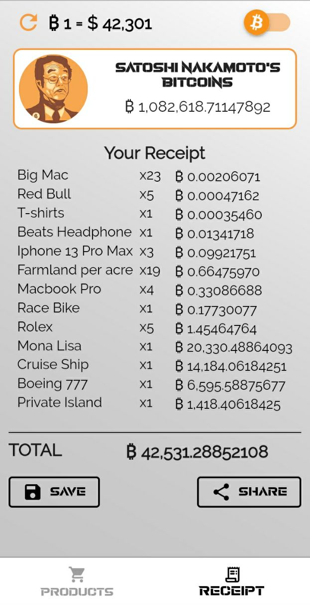

# Satoshi Nakamoto's Bitcoins

Satoshi Nakamoto's Bitcoins is an app that allows you to simulate spending money with the more than 1.1 million Bitcoins owned by Satoshi Nakamoto. With this app, you can experience the thrill of making extravagant purchases such as buying a house, a Ferrari, or a luxury yacht, all using Bitcoins. Spend them as you wish and live a lavish virtual lifestyle!

## Tech Stack

- Dart
- Flutter
- CoinGecko API

## Pages

The app consists of the following pages:

1. Starting page: This page provides some introductory information about the app. It sets the context and prepares the user for the spending simulation experience.

2. Simulation page: Here, you can spend your Bitcoins or dollars to purchase various items. Explore the wide range of options available and simulate your dream purchases. Experience the thrill of living a luxurious life with Satoshi Nakamoto's Bitcoins.

3. Receipt page: After completing your spending simulation, you can view a summary of your purchases on the receipt page. Save or share your receipt to showcase your extravagant shopping spree.

## Installation and Usage

To install and use Satoshi Nakamoto's Bitcoins app, follow these steps:

1. Make sure you have Dart and Flutter installed on your system.
2. Clone the repository:
```git clone <repository_url>```
3. Navigate to the project directory:
```cd satoshi_bitcoins```
4. Install the dependencies:
```flutter pub get```
5. Run the app:
```flutter run```

## Screenshots

  


## Google Play Store

You can download Satoshi Nakamoto's Bitcoins from the [Google Play Store](https://play.google.com/store/apps/details?id=com.spend_satoshis_bitcoins) to enjoy the virtual spending experience on your Android device.

## Contributions

Contributions to Satoshi Nakamoto's Bitcoins are welcome! If you encounter any bugs or have suggestions for new features, please open an issue in the GitHub repository. Additionally, you can submit pull requests to contribute code improvements.
